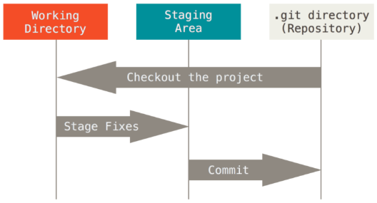

# Git 기초

### Git 초기 설정

> 최초 한 번만 설정

```bash
	$ git config --global user.name "이름"
	$ git config --global user.email "메일 주소"
```

​	작성자가 올바르게 설정되었는지 확인

```bash
	$ git config --global -l
	또는
	$ git config --global -list
```

---

### Git 기본 명령어

1. **로컬 저장소**



